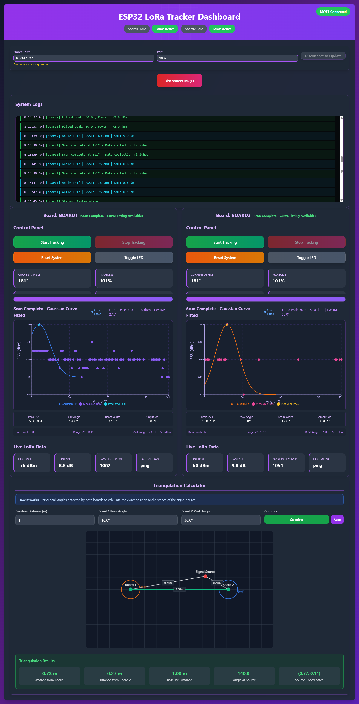

# Dual Directional Antenna Based Localization



## Mosquitto MQTT Broker Setup with ESP32 and React Dashboard on Windows

This guide will help you set up a Mosquitto MQTT broker on Windows, connect ESP32 devices for IoT communication, and run a React dashboard for monitoring and control in a dual directional antenna-based localization system.

## Project Structure

```
project-root/
├── dashboard/             # Vite React web application
│   ├── package.json
│   ├── src/
│   └── ...
├── receiver/
│   └── receiver.ino      # ESP32 receiver code
├── transmitter/
│   └── transmitter.ino   # ESP32 transmitter code
└── README.md
```

## Hardware Setup

### ESP32 Board Configuration

- **Transmitter ESP32**: Configured with appropriate antenna for chosen frequency
- **Receiver ESP32**: Configured with matching antenna and WiFi connectivity
- **Buck Converter**: Recommended for stable power supply to both ESP32 boards
- **Antennas**: Properly tuned for your configured frequency (433MHz, 915MHz, etc.)

## Prerequisites

- Windows 10/11
- ESP32 development board(s)
- Arduino IDE or PlatformIO
- Node.js (for React dashboard)
- WiFi network access

## Step 1: Install Mosquitto on Windows

1. **Download Mosquitto**

   - Visit [mosquitto.org/download](https://mosquitto.org/download/)
   - Download the Windows installer (64-bit recommended)
   - Run the installer as administrator

2. **Add Mosquitto to System PATH**
   - Open System Properties → Advanced → System Variables
   - Add `C:\Program Files\mosquitto` to your PATH variable

## Step 2: Create Required Directories

Create the following directories for Mosquitto data and logs:

```cmd
mkdir C:\mosquitto\data
mkdir C:\mosquitto\log
```

## Step 3: Configure Mosquitto

1. Navigate to `C:\Program Files\mosquitto`
2. Open `mosquitto.conf` file (create if it doesn't exist)
3. Add the following configuration at the end of the file:

```conf
# Allow anonymous connections
allow_anonymous true

# Plain MQTT (ESP32, MQTT clients)
listener 1883
protocol mqtt

# WebSockets (browser dashboard)
listener 9002
protocol websockets

# Persistence & logging
persistence true
persistence_location C:\mosquitto\data\
log_dest file C:\mosquitto\log\mosquitto.log
```

## Step 4: Start Mosquitto Service

Open Command Prompt as administrator and run:

```cmd
net start mosquitto
```

Expected output:

```
The Mosquitto Broker service is starting.
The Mosquitto Broker service was started successfully.
```

## Step 5: Find Your PC's IP Address

Open Command Prompt and run:

```cmd
ipconfig
```

Note your IPv4 address (e.g., `10.214.162.1`)

## Step 6: ESP32 Setup

### Power Supply Recommendation

**Important:** For reliable operation, it's recommended to use a buck converter for powering ESP32 boards instead of the onboard voltage regulator. This ensures stable power delivery and prevents brownouts during WiFi transmission.

### Transmitter Setup

1. Open Arduino IDE or PlatformIO
2. Load the `transmitter/transmitter.ino` file
3. Update the following variables in the code:
   - `ANTENNA_FREQUENCY`: Set your desired antenna frequency design (e.g., `433E6` for 433MHz, `915E6` for 915MHz)
   - `BOARD_ID`: Set to `"board1"` or `"board2"` depending on which transmitter this is
4. Upload the code to your ESP32 transmitter device

**Note:** The transmitter does not require WiFi or MQTT configuration as it communicates directly via radio frequency.

### Receiver Setup

1. Load the `receiver/receiver.ino` file
2. Update the following variables in the code:
   - `ssid`: Your WiFi network name
   - `password`: Your WiFi password
   - `mqtt_server`: Your PC's IP address (from Step 5)
   - `ANTENNA_FREQUENCY`: Set to match your transmitter's frequency (e.g., `433E6` for 433MHz, `915E6` for 915MHz)
   - `BOARD_ID`: Set to `"board1"` or `"board2"` to match the corresponding transmitter
3. Upload the code to your ESP32 receiver device

## Step 7: React Dashboard Setup

### Install Dependencies

1. Navigate to the dashboard directory:

```cmd
cd dashboard
```

2. Install the required packages:

```cmd
npm install
```

### Run the Development Server

Start the React development server:

```cmd
npm run dev
```

The dashboard should now be accessible at `http://localhost:5173` (or the port specified by Vite).

## Step 8: Testing the System

### Monitor ESP32 Communication

Open Command Prompt and run:

```cmd
mosquitto_sub -h 10.214.162.1 -t "esp32/+"
```

This will subscribe to all ESP32-related topics and show data received from the transmitter via the receiver.

### Test Individual Topics

**Monitor receiver status and data:**

```cmd
mosquitto_sub -h 10.214.162.1 -t "esp32/receiver/status"
mosquitto_sub -h 10.214.162.1 -t "esp32/receiver/data"
```

**Monitor board-specific data:**

```cmd
mosquitto_sub -h 10.214.162.1 -t "esp32/board1/+"
mosquitto_sub -h 10.214.162.1 -t "esp32/board2/+"
```

**Control receiver via MQTT:**

```cmd
mosquitto_pub -h 10.214.162.1 -t "esp32/receiver/control" -m "reset"
```

**Note:** The transmitter communicates via RF only and does not publish directly to MQTT. All MQTT communication comes through the receiver.

## Command Breakdown

### mosquitto_sub Commands

```cmd
mosquitto_sub -h 10.214.162.1 -t "esp32/+"
```

- `-h 10.214.162.1`: Specifies the MQTT broker's IP address
- `-t "esp32/+"`: Subscribes to all topics starting with "esp32/" (wildcard subscription)

### mosquitto_pub Commands

```cmd
mosquitto_pub -h 10.214.162.1 -t "esp32/transmitter/control" -m "start"
```

- `-h 10.214.162.1`: Specifies the MQTT broker's IP address
- `-t "esp32/transmitter/control"`: Sets the target topic
- `-m "start"`: Sends the message "start" to the topic

## Development Workflow

### Starting the Complete System

1. **Start Mosquitto Broker:**

   ```cmd
   net start mosquitto
   ```

2. **Start React Dashboard:**

   ```cmd
   cd dashboard
   npm run dev
   ```

3. **Flash and Connect ESP32 Devices:**

   - Upload `transmitter.ino` to transmitter ESP32 (configure ANTENNA_FREQUENCY and BOARD_ID)
   - Upload `receiver.ino` to receiver ESP32 (configure WiFi, MQTT, ANTENNA_FREQUENCY, and BOARD_ID)
   - Transmitter will start broadcasting via RF
   - Receiver will connect to WiFi and MQTT broker, forwarding received RF data

4. **Access Dashboard:**
   - Open browser to `http://localhost:5173`
   - Monitor real-time localization data from ESP32 devices
   - Send commands through the web interface

### Dashboard Features

The React dashboard provides:

- Real-time MQTT message monitoring from receiver
- Localization data visualization and tracking
- Device status indicators for receiver and connected transmitters
- Interactive controls for receiver device
- WebSocket connection to Mosquitto (port 9002)
- Board-specific data visualization (board1, board2)
- RF signal strength and directional antenna monitoring
- Real-time positioning and triangulation display
- Responsive design for desktop and mobile

## Troubleshooting

### Common Issues

1. **Mosquitto service won't start:**

   - Check if port 1883 is already in use
   - Run Command Prompt as administrator
   - Verify configuration file syntax

2. **ESP32 devices can't connect:**

   - **Receiver issues:**
     - Ensure receiver ESP32 and PC are on the same network
     - Check Windows Firewall settings (allow ports 1883, 9002)
     - Verify the IP address is correct in receiver code
     - Make sure Mosquitto service is running
   - **Transmitter issues:**
     - Check antenna frequency configuration matches receiver
     - Verify BOARD_ID is properly set and unique
     - Ensure proper power supply (use buck converter)
     - Check RF transmission range

3. **React dashboard won't start:**

   - Ensure Node.js is installed
   - Run `npm install` in the dashboard directory
   - Check for port conflicts (default: 5173)

4. **WebSocket connection fails:**
   - Verify Mosquitto is configured for WebSockets (port 9002)
   - Check browser console for connection errors
   - Ensure firewall allows port 9002

### Firewall Configuration

Allow Mosquitto through Windows Firewall:

1. Open Windows Defender Firewall
2. Click "Allow an app or feature through Windows Defender Firewall"
3. Add `mosquitto.exe` and allow both private and public networks
4. Ensure ports 1883 and 9002 are open

## File Structure Details

```
C:\Program Files\mosquitto\
├── mosquitto.conf          # Configuration file
├── mosquitto.exe          # Main executable
└── ...

C:\mosquitto\
├── data\                  # Persistence data
└── log\                   # Log files
    └── mosquitto.log

project-root/
├── dashboard/             # React dashboard
│   ├── package.json
│   ├── vite.config.js
│   ├── src/
│   │   ├── App.jsx
│   │   ├── components/
│   │   └── ...
│   └── dist/             # Built files (after npm run build)
├── receiver/
│   └── receiver.ino      # ESP32 receiver firmware
└── transmitter/
    └── transmitter.ino   # ESP32 transmitter firmware
```

## Additional Commands

### Stop Services

```cmd
# Stop Mosquitto
net stop mosquitto

# Stop React dev server
# Press Ctrl+C in the terminal running npm run dev
```

### View Logs

```cmd
# View Mosquitto logs
type C:\mosquitto\log\mosquitto.log

# View real-time logs
tail -f C:\mosquitto\log\mosquitto.log
```

### Build Dashboard for Production

```cmd
cd dashboard
npm run build
```

## Security Notes

This configuration allows anonymous connections for testing purposes. For production use, consider:

- Setting up username/password authentication
- Using SSL/TLS encryption
- Configuring proper access control lists
- Disabling anonymous access
- Using environment variables for sensitive data

**Note:** Transmitter boards communicate via RF to the receiver, which then publishes the data to appropriate MQTT topics based on BOARD_ID.

## License

This setup guide is provided as-is for educational and development purposes.
